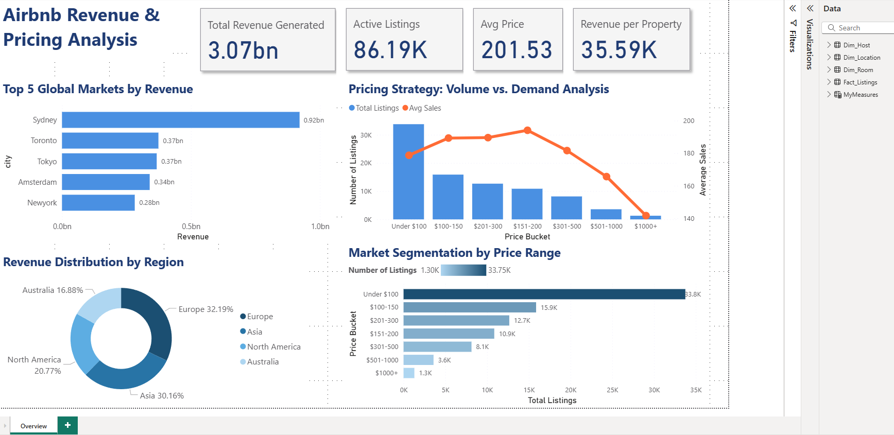

## Overview
Airbnb Revenue & Pricing Analysis (Power BI Project)

This project analyzes global Airbnb listing performance using Power BI. The goal was to explore how pricing, demand, and location impact revenue across major cities and regions. The dataset (86,000+ listings) was cleaned, modeled, and visualized to uncover meaningful business insights.

## Key Steps

Performed ETL in Power Query: cleaning, imputing missing values, fixing regions, and standardizing fields.

Built a star schema with one fact table and three dimension tables (Location, Host, Room).

Created DAX measures for revenue, listings, average price, and revenue per property.

Developed interactive visuals for pricing strategy, regional performance, and market segmentation.

## Key Insights

Strong inverse relationship between price and demand.

Optimal pricing range: $151–200, with best revenue + demand balance.

Europe and Asia generate the highest overall revenue.

Mid-tier price ranges dominate supply and performance.

High-end listings ($500+) show low demand.

## Deliverables

Full Power BI report

Dashboard visuals: KPIs, top markets, regional revenue, pricing strategy, segmentation

Final presentation summarizing insights and strategic recommendations

### Datset Source/Credit
[Airbnb_site_hotel by Willian Oliveira](https://www.kaggle.com/datasets/willianoliveiragibin/airbnb-site-hotel)
