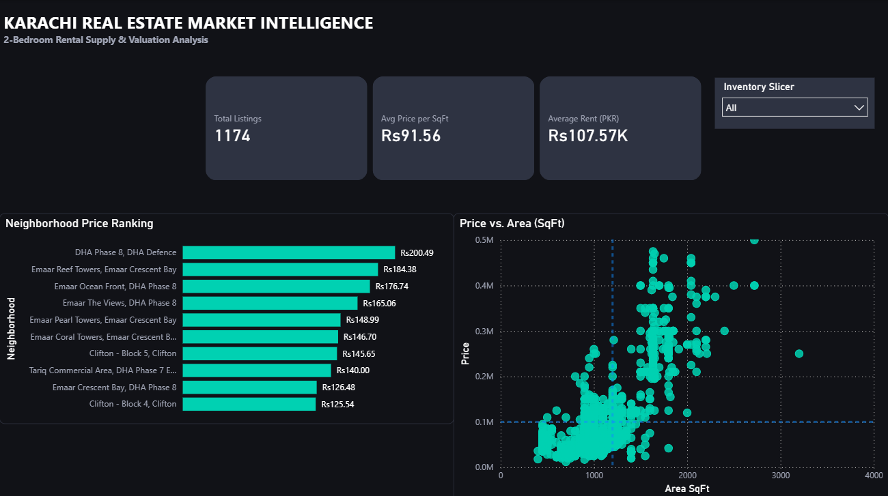

# Karachi Real Estate Market Intelligence
**End-to-End Data Pipeline & Rental Valuation Analysis**



## Executive Summary

This project is an end-to-end data engineering and analytics solution built to analyze the Karachi residential rental market (focusing on 2-bedroom listings across major precincts like DHA, Emaar, Clifton, and Bahria Town).

Landlords frequently list properties at arbitrary prices. This project solves that problem by scraping live rental data, structuring it into a SQL data warehouse, visualizing market trends in Power BI, and providing an ad-hoc Excel valuation tool to evaluate whether a listing is a BARGAIN or OVERPRICED based on historical benchmark rates per square foot(PKR/SqFt).

### Technical Architecture & Pipeline
```text
[ Python Scraper ] ──> [ Raw Data (CSV) ] ──> [ SQL Warehouse (BigQuery) ]
                                                     │
                                     ┌───────────────┴───────────────┐
                                     ▼                               ▼
                           [ Power BI Dashboard ]          [ Excel Valuation Tool ]
```


#### 1. Data Ingestion (Python): 
Automated web scraper built with Python to extract active residential rental listings, space dimensions (SqFt), property types, and pricing.

#### 2. Data Modeling & Transformation (SQL): 
Structured raw scraped data into a Star Schema with dimension (dim_location) and fact (fact_listings) tables in BigQuery.

#### 3.
Executive BI Dashboard (Power BI): Designed a dark-theme analytics dashboard tracking market KPIs, neighborhood price rankings, and a localized price-to-size scatter plot.

#### 3. 
Ad-Hoc Valuation Tool (Excel): Built an automated calculator leveraging neighborhood dynamic benchmarks(Price/SqFt) to flag listings as BARGAIN (Below Market Avg) or OVERPRICED (Above Market Avg).

### Key Features & Visualizations

#### 1. Power BI Executive Dashboard (/dashboard)KPI Header Tiles: 
Tracks Total Market Inventory, Average Price per SqFt (PKR/SqFt), and Overall Average Rent.Neighborhood Price Ranking: Horizontal clustered bar chart categorizing average unit pricing across premium zones (e.g., DHA Phase 8, Emaar Reef Towers, Clifton).Price vs. Area (SqFt) Quadrant: Filtered scatter plot mapping listing distribution to quickly identify underpriced properties and eliminate extreme outlier size noise.Inventory Slicer: Dynamic dropdown filtering across sub-market inventories.

- **KPI Header Tiles**: Tracks Total Market Inventory, Average Price per SqFt (PKR/SqFt), and Overall Average Rent.
- **Neighborhood Price Ranking**: Horizontal clustered bar chart categorizing average unit pricing across premium zones (e.g., DHA Phase 8, Emaar Reef Towers, Clifton).
- **Price vs. Area (SqFt) Quadrant**: Filtered scatter plot mapping listing distribution to quickly identify underpriced properties and eliminate extreme outlier size noise.
- **Inventory Slicer**: Dynamic dropdown filtering across sub-market inventories.

#### 2. Excel Ad-Hoc Valuation Calculator (/excel)

- **Price / SqFt Standardization:** Equalizes property sizes by evaluating the unit cost of space rather than total rent.
- **Dynamic Benchmark Lookup**: Calculates localized neighborhood fair market baselines using statistical aggregations.
- **Automated Bargain Detector**: Uses dynamic formulas to output immediate status indicators (BARGAIN vs. OVERPRICED) with custom visual formatting.


### Tech Stack & Tools

- **Languages**: Python 3.x, SQL, DAX
- **Data Processing & Scraping**: Pandas, BeautifulSoup / Requests
- **Data Warehousing**: Google BigQuery / SQL Server (Star Schema Architecture)
- **Business Intelligence**: Microsoft Power BI Desktop
- **Ad-Hoc Analysis**: Microsoft Excel (Advanced SUMIFS, Dynamic Logic Arrays, Conditional Formatting)

### How to Use

#### 1. Data Pipeline:
- Run python/zameen_scraper.py to extract raw rental listings into CSV format.
- Execute sql/01_ddl_star_schema.sql and sql/02_dml_transformations.sql in your SQL data warehouse to build and populate dimension/fact tables.

#### 2. Power BI Dashboard:
- Open dashboard/karachi_rental_intelligence.pbix in Power BI Desktop to interact with market filters and area pricing analytics.

#### 3. Excel Valuation Tool:
- Open excel/karachi_rentals_adhoc_pivot_tool.xlsx, select a target neighborhood, input desired space (SqFt) and proposed rent to get an automated fair-market valuation.


