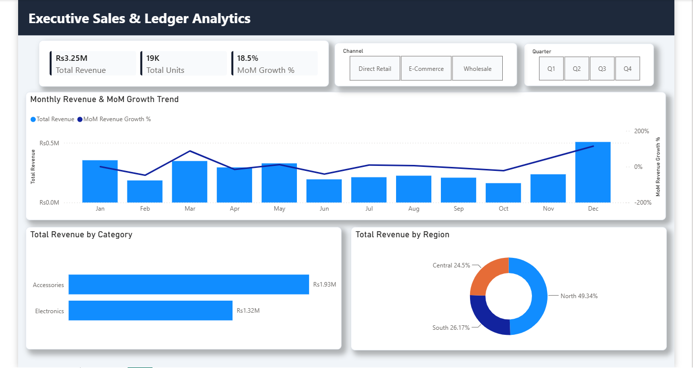

# Enterprise Sales & Ledger Analytics Pipeline (Power BI / Power Query / DAX)



## Executive Summary
This repository contains an end-to-end data analytics and automated ingestion pipeline built in **Power BI**. The project solves a common enterprise data challenge: consolidating fragmented, multi-file monthly financial ledgers with dirty multi-row header metadata into a unified, scalable Star Schema data model with Month-over-Month (MoM) performance tracking.

---

## Business Problem
The client receives transactional sales data split into individual monthly Excel ledgers (`Ledger_YYYY_MM.xlsx`). Each file contains top-level metadata blocks, duplicated header rows, and summary footers that break standard Power BI imports. 

### Key Technical Challenges:
1. **Dirty File Structure:** Non-standard rows, null blocks, and repeating column headers across files.
2. **Scalability Requirement:** The pipeline must automatically ingest new monthly ledger files dropped into the source directory without manual intervention or query re-configuration.
3. **Time-Intelligence Accuracy:** Raw datasets lack continuous calendar dimensions, breaking Month-over-Month (MoM) calculations across reporting periods.

---

## Solution Architecture & Pipeline Overview

[ Local / Cloud Directory ]
│ (Folder.Files Ingestion)
▼
[ Power Query ETL Engine ] ──► Strips multi-row metadata, flattens headers, filters nulls
│
▼
[ Relational Star Schema ] ──► Dim_Products, Dim_Towns, Dim_Channels, Dim_Date, Fact_Sales
│
▼
[ DAX Analytics Engine ]   ──► Base aggregations + Time-Intelligence (MoM Revenue Growth %)
│
▼
[ Executive UI & Fabric ]  ──► Executive Dark Header Layout + Microsoft Fabric Workspace Ready

---

## Data Transformation Logic (Power Query / M)

The extraction engine leverages M-code to parse the directory dynamically using `Folder.Files`. 

### Ingestion & Cleaning Workflow:
1. **Dynamic Folder Scan:** Ingests all `.xlsx` files from the specified target directory path.
2. **Structural Cleansing:** Filters out nulls and summary blocks across `Column2` to eliminate file-level footers.
3. **Dynamic Promotion:** Promotes the first valid data row to headers and filters out remaining embedded header rows (`Date = "Date"`) across concatenated files.
4. **Data Typing:** Converts metrics to `Fixed Decimal Number` (Currency) and numeric volumes to `Whole Number`.

> See full M-code implementation in [`power_query/folder_ingestion_cleaning.m`](power_query/folder_ingestion_cleaning.m).

---

## Data Model (Star Schema)

The dataset was transformed from a single flat table into an optimized relational **Star Schema** with $1 \rightarrow \text{*}$ single-direction relationships to enforce strong data integrity and optimize engine performance.

| Table Name | Type | Description | Keys |
| :--- | :--- | :--- | :--- |
| **`Fact_Sales`** | Fact | Granular sales transactions | `Product_ID`, `Town_ID`, `Channel_ID`, `Date` |
| **`Dim_Products`** | Dimension | Product metadata & categories | `Product_ID` (PK) |
| **`Dim_Towns`** | Dimension | Regional geographic distribution | `Town_ID` (PK) |
| **`Dim_Channels`** | Dimension | Sales channels (Retail, E-Commerce, Wholesale) | `Channel_ID` (PK) |
| **`Dim_Date`** | Dimension | Contiguous calendar dates generated via DAX | `Date` (PK) |

*Note: Foreign keys inside `Fact_Sales` are hidden from the report view to ensure users only filter via indexed dimension tables.*

---

## Core DAX Metrics Library

All measures are isolated in a dedicated `_Measures` table and documented for **Microsoft Fabric / Copilot** natural language querying.

### 1. Base Aggregations
```dax
Total Revenue = SUM(Fact_Sales[Total_Revenue])

Total Units = SUM(Fact_Sales[Units_Sold])
```

### 2. Time-Intelligence (Month-over-Month Growth)
```dax
Prior Month Revenue = 
CALCULATE(
    [Total Revenue],
    DATEADD(Dim_Date[Date], -1, MONTH)
)

MoM Revenue Growth % = 
VAR CurrentMonth = [Total Revenue]
VAR PrevMonth = [Prior Month Revenue]
RETURN
DIVIDE(CurrentMonth - PrevMonth, PrevMonth, 0)
```

See full DAX library in dax/measures.dax.

### UI / Dashboard Design System

- Header Banner: #0F172A (Dark Slate) full-width container providing executive branding.

- Canvas Background: #F1F5F9 (Light Gray) with zero-transparency rendering.

- Visual Styling: Individual visuals configured as #FFFFFF floating white cards with 8px rounded borders and soft drop shadows for clear visual hierarchy.

- Metrics: Top Executive KPI Tiles, Monthly Combined Trend (Line & Stacked Column), Category Performance (Bar Chart), and Regional Contribution (Donut Chart with direct callout labels).

### Verification & Automated Refresh Test

#### To verify the automated scalability:

- A new monthly file (Ledger_2026_01.xlsx) was added to the source folder directory.

- Triggered Refresh (Data and Schema) in Power BI.

- Power Query successfully scanned, cleaned, and appended the new dataset to Fact_Sales, dynamically updating Dim_Date and all DAX visuals with zero manual query editing.