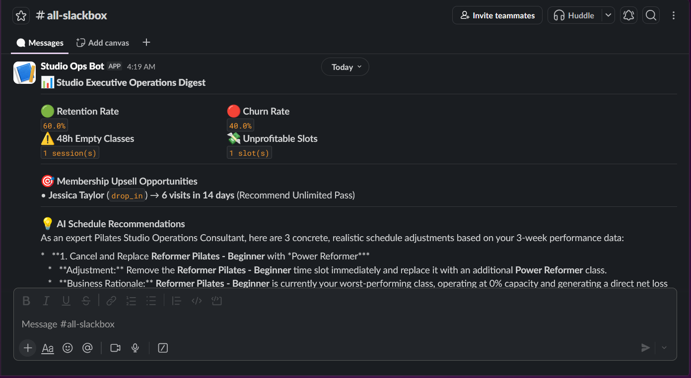

# Automated Studio Operations Manager (Momence + Gemini + Slack)

An end-to-end operational intelligence engine built for fitness and wellness studios using the **Momence V2 REST API**, **Python**, **Google Gemini AI**, and **Slack Webhooks**. 

This system acts as an automated operations manager—monitoring studio performance 24/7, auditing class slot profitability against instructor pay, flagging low retention, and dispatching actionable AI schedule optimizations directly to team channels.



---

### Key Operational Capabilities

* **48-Hour Empty Class Alerts:** Scans upcoming sessions and flags unbooked classes 48 hours in advance to prevent wasted instructor costs.
* **3-Week Rolling Capacity Audit:** Tracks class slot utilization to highlight underperforming slots (<50% capacity) and oversubscribed sessions (>80% capacity).
* **True Net Profitability Analysis:** Calculates net profit per class session by evaluating gross ticket revenue against instructor pay rates and room overhead costs.
* **Membership Health Metrics:** Calculates rolling 30-day retention vs. churn rates and flags high-frequency drop-in members attending 3+ times/week for recurring plan upsells.
* **Gemini AI Schedule Optimization:** Feeds capacity and profit metrics into `gemini-3.6-flash` to generate 3 concrete, data-backed schedule re-allocation strategies.
* **Rich Slack Executive Digest:** Formats all alerts, financial KPIs, upsell targets, and AI recommendations into a clean, block-formatted Slack digest.

---

### Tech Stack

* **Language:** Python 3.11+
* **Integrations:** Momence V2 REST API, Google Gemini API (`google-genai`), Slack Webhooks
* **Data Handling:** `requests`, `python-dotenv`
* **AI Model:** `gemini-3.6-flash`

---

### Environment Setup

Create a `.env` file in the project root with the following configuration:

```env
MOMENCE_CLIENT_ID=your_client_id
MOMENCE_CLIENT_SECRET=your_client_secret
MOMENCE_SERVICE_EMAIL=your_email
MOMENCE_SERVICE_PASSWORD=your_password
GEMINI_API_KEY=your_gemini_api_key
SLACK_WEBHOOK_URL=your_slack_webhook_url
```

### Execution

python main.py
