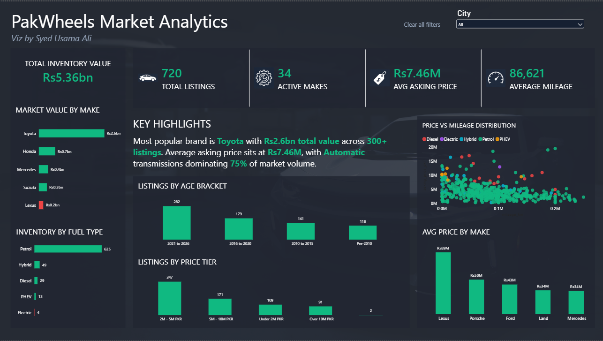
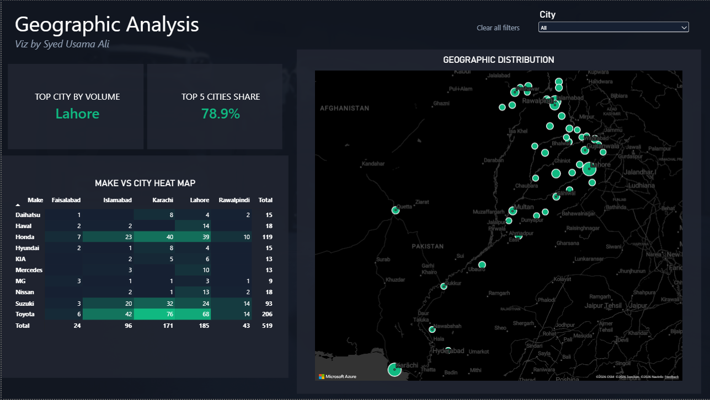

# PakWheels End-to-End Automobile Market Analytics Pipeline





An end-to-end, scalable data pipeline and interactive Power BI dashboard that extracts, transforms, and visualizes used car market data from PakWheels. 

The system runs an automated Python web crawler that generates daily timestamped CSV exports into a designated folder directory. Power BI connects directly to this directory via a Folder Connector, allowing the 3-page executive dashboard to automatically ingest daily incremental data upon refresh.

---

## Architecture & Data Flow

```text
[ PakWheels Web ] ──> ( Python Scraper / curl_cffi ) ──> [ Daily CSV Export ]
                                                              │
                                                    ( ./data/ Folder )
                                                              │
[ Executive Report ] <── ( 3-Page Power BI ) <── ( Power Query Folder Connector )

---

### Mermaid Diagram (GitHub Native Visual Renderer)

```markdown


1. **Extraction:** `pipeline.py` uses `curl_cffi` (impersonating Chrome TLS fingerprints) to bypass scraping blocks and collect pagination search results.
2. **Transformation:** Converts PKR Lac/Crore price strings into standard integers, parses mileage/specs, and builds categorical bins (`price_tier` and `age_bracket`) using `pandas`.
3. **Storage:** Appends output files named `pakwheels_listings_YYYY_MM_DD.csv` into `./data/`.
4. **Ingestion:** Power BI connects to the `./data/` folder, combining all historic and daily files dynamically into a unified Star Schema data model.

---

## Executive Dashboard Overview

### Page 1: Market Analysis
Evaluates macro inventory value (PKR 5.36B+), active brand counts, average asking price, and mileage distributions alongside price vs. mileage scatter plots.


---

### Page 2: Geographic Analysis
Maps regional inventory concentration, featuring a 40/60 container split with a Matrix Heat Map and a dark geospatial map layer highlighting regional volume dominance.


---

### Page 3: Vehicle Details (Drill-Through)
Provides granular, record-level vehicle inspection with cross-report drill-through capabilities from any brand or city on Pages 1 and 2.

---

## Technical Stack

* **Data Extraction & Transformation:** Python 3.x, `curl_cffi`, `BeautifulSoup4`, `pandas`, `re`
* **Data Ingestion & Modeling:** Power Query (Folder Data Connector), DAX (Time Intelligence, Dynamic Ranking, Regional Concentration)
* **Visualization:** Power BI Desktop (Dark Slate `#162032` Theme, Custom KPI Cards, Matrix Heat Maps, Drill-Through Navigation)

---

## How to Run

1. **Clone the Repository:**
```bash
git clone [https://github.com/tsylanaatadbwen/pakwheels-market-analytics.git](https://github.com/tsylanaatadbwen/pakwheels-market-analytics.git)
cd pakwheels-market-analytics

2. **Setup Python & Run Data Extraction:**
 ```bash
python -m venv venv
source venv/bin/activate  # On Windows: venv\Scripts\activate
pip install -r requirements.txt
python pipeline.py
```

3. **Open Executive Report:**
Open PakWheels_Market_Analytics.pbix in Power BI Desktop and click Refresh to load the newly exported dataset from ./data/.
